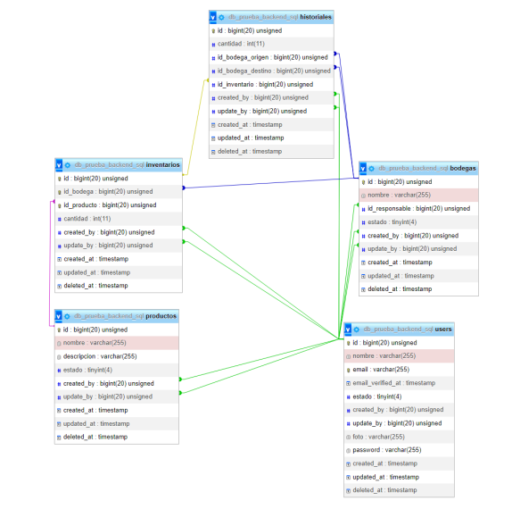

# Sistema de Manejo de Inventarios

Este proyecto es un sistema de manejo de inventarios que permite a los usuarios gestionar productos, bodegas, inventarios e historiales de movimiento de productos. El sistema implementa autenticación basada en tokens para acceder a los diferentes endpoints y también incluye un sistema de límite de peticiones para garantizar la seguridad y el uso eficiente de los recursos.


### Diagrama



### INFORMACION DEL PROYECTO

Esta documentación describe una aplicación de gestion de inventarios construida utilizando Node.js, Express.js y MongoDB como base de datos. La aplicación cuenta con un sistema de autenticación basado en JWT (JSON Web Tokens) y utiliza las librerías `class-transformer`, `class-validator`, `dotenv`, `express-session`, `jose`, `MongoDB`, `nodemon`, `reflect-metadata`, y `typescript`.

## Requisitos previos

- Node js instalado en tu maquina (Recomendada v18.16.0)
- MongoDB instalado y configurado con las credenciales necesarias para conectarse a la base de datos.

## Instalación

**Repositorio a clonar:**

Clona este repositorio o descarga los archivos en tu máquina local.

- `https://github.com/C-jimenez21/mongoBodega`

**Instalación de dependencias:**

una vez clonado se procede a ejecutar el siguiente comando en la terminal:

```
npm install
```

## Instrucciones de uso

- Una vez instalado el proyecto se debe configurar las variables de entorno para ello crea el archivo **.env**, lo siguiente es la estructura que debe usar, también está en .env.example

```
MY_SERVER={"hostname":"uri-servidor", "port":"puerto de escucha"}
ATLAS_USER="Usuario de mongo"
ATLAS_PASSWORD="contraseña de mongo"
ATLAS_DATABASE="nombre de la base de datos de mongo"
```

**Instalación de la base de datos:**

Para instalar la base de datos y configurar las tablas necesarias, sigue estos pasos:

1. Asegúrate de tener MongoDB instalado en tu sistema y que estas conectado.
2. Abre la carpeta `scripts`y el archivo `Bodegas.mongodb`
3. A continuación ejecuta cada una de las peticiones.

Una vez realizado todo el proceso tendrás la base datos `mongoBodegas` con sus respectivas tablas y datos en cada una de ellas para ejecutar las peticiones

**Arranque del programa:**

- iniciar transcopilador: `npm run tsc`

- iniciar nodemon que esta señalando a app.js : `npm run dev` en otra terminal si es necesario 

  El servidor debería iniciarse y estar listo para recibir solicitudes en la dirección `http://127.10.10.10:5050/` (puedes cambiar el puerto en el archivo `.env` si lo deseas).

- Thunder Client (extensión de Visual Studio Code) mostrará la respuesta de la solicitud en el panel de resultados. Aquí podrás ver el código de estado, los encabezados y el cuerpo de la respuesta. (agrega la solicitud HTTP para hacer las consultas, la URL se muestra despues de ejecutar nodemon en la consola asi: `Servidor activo en http://127.10.10.10:5050`


Una vez que observamos que el servidor esta activo procedemos a acceder a los router, sin embargo debemos generar el token antes por lo que procedemos:

#### **Ir el metodo GET **

Se debe generar el token según la colección a la que querramos acceder

```
http://127.10.10.10:5050/token/:collection
```

Esto nos dara una serie de caracteres, estos conforman nuestro token

Procedemos a copiar el token y a colocarlo en la parte de headers mas concretamente como "Authorization" y nos dirigimos al endpoint al cual le queramos realizar un peticion y si el token es valido, accederá de lo contrario te arrojara que no estas autorizado para acceder.

Cabe recalcar que el token cuenta con un tiempo de duración de 5 min despues de esto expirara y tendras que generar otro

#### GET

```
http://127.10.10.10:5050/token/bodegas
http://127.10.10.10:5050/token/productos
http://127.10.10.10:5050/token/inventarios
```

## Endpoints y Métodos

A continuación, se describen los endpoints disponibles en la aplicación junto con sus respectivos métodos HTTP y formatos de datos requeridos.

* Realizar un EndPolnt que permita listar todas las bodegas ordenadas alfabéticamente.

GET

```
http://127.10.10.10:5050/apiV1/bodegas
```

* Realizar un EndPolnt que permita crear una bodega.

POST

```
http://127.10.10.10:5050/apiV1/bodegas
```

```
{
  "Nombre_Bodega": "bodega prueba 1",
  "Id_Responsable_Bodega": 2,
  "Estado_Bodega": 1
}
```


* Realizar un EndPoint que permita listar todos los productos en orden descendente por el campo "Total". • El campo "Total" es la cantidad de unidades que la empresa tiene de este producto, considerando la unión de todas las bodegas, es decir que el dato como tal no existe en la base de datos,sino se debe calcular. Si la Bodega A tiene 1O unidades, la Bodega B tiene 5 unidades y la Bodega C tiene 3 unidades. Total= 18.

GET

```
http://127.10.10.10:5050/apiV1/productos/totalProductos
```


* Realizar un EndPoint que permita insertar un productos y a su vez asigne una cantidad inicial del mismo en la tabla inventarios en una de las bodegas por default.

POST

```
http://127.10.10.10:5050/apiV1/productos
```

```
{
  "Nombre_Producto": "producto prueba 1",
  "Created_by" : 3,
  "Estado_producto": 4
}
```

NOTA: por default el la cantidad inicial es de 100 y se crea en la bodega 5


* Realizar un EndPoint que permita insertar registros en la tabla de inventarios, los parámetros de entradadebenser (id_producto,id_bodega,cantidad). • La tabla no puede repetir la combinación de Bodega I Producto Por lo tanto será necesario validar si el ingreso que se está realizado ya existe o es una combinación totalmente nueva. • Si es una combinación totalmente nueva, se debe hacer un lnsert, considerando los datos ingresados. • Si es una combinación existente, entonces se debe hacer un Update a este registro, considerando la suma de la cantidad existente con la  cantidad nueva

POST

```
http://127.10.10.10:5050/apiV1/inventarios
```

```
Crear
 {
  "Id_Bodega": 12,
  "Id_Producto":25,
  "Cantidad_Inventario": 10
  }
```

```
Actualizar
{
  "Id_Bodega": 28,
  "Id_Producto":27,
  "Cantidad_Inventario": 10
  }
```


* Realizar un EndPolnt que permita Trasladar unproducto de una bodega a otra • Se debe validar que la cantidad de unidades que se pretende sacar de una Bodega, sea posible, ya que si tengo 1O unidades en la Bodega A, no podré sacar de ella 20 unidades. Esta acción debe generar una alerta e impedir el registro. • Para la afectación de las tablas se debe considerar que del Origen debo restar la cantidad,y al destino le debo sumar lacantidad. Por ejemplo: Bodega A = 1O unidades. Bodega B = 1O unidades. Haré el traslado de 5 unidades desde la Bodega A para la Bodega B,Por lo cual el resultado será hacer Updated a los dos registros en inventarios: Bodega A = 5 unidades. Bodega B = 15 unidades.

POST

```
http://127.10.10.10:5050/apiV1/productos/trasladar
```

```
Existe en ambos inventarios
{
  "bodegaOrigen":12,
  "bodegaDestino":19,
  "productoId":18,
  "cantidad":10
}

Existe en el origen y crea el destino
{
  "bodegaOrigen": 12,
  "bodegaDestino": 25,
  "productoId": 18,
  "cantidad": 10
}

No exite el prodcuto en la bodega origen por lo que rechaza 
{
  "bodegaOrigen": 12,
  "bodegaDestino": 25,
  "productoId": 18,
  "cantidad": 10
}
```

## Contacto

Si tienes alguna pregunta o comentario sobre esta aplicación, no dudes en ponerte en contacto con nosotros a través de [cristianjj21@gmail.com](mailto:cristianjj21@gmail.com). ¡Esperamos que disfrutes usando nuestra aplicación de agendamiento de citas odontológicas!